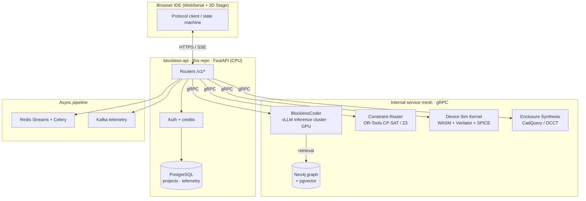

<div align="center">

# Blockless API

**The inference, verification, and orchestration control-plane behind [Blockless](https://blockless.dev) — the AI-native platform that turns a plain-language idea into a working, simulated, manufacturable hardware device.**

### ▶ [**Open the live product demo**](https://leezisheng.github.io/blockless-api-main/)

[](https://leezisheng.github.io/blockless-api-main/)
[](https://htmlpreview.github.io/?https://github.com/leezisheng/blockless-api-main/blob/main/index.html)

[](https://www.python.org/)
[](https://fastapi.tiangolo.com/)
[](https://grpc.io/)
[](https://www.postgresql.org/)
[](https://neo4j.com/)
[](https://kubernetes.io/)
[](LICENSE)
[](.github/workflows/ci.yml)

</div>

---

## Overview

AI can already generate embedded firmware and even draft schematics with 2D circuit
simulation — yet a beginner still can't ship a device. Those tools assume you can read
code, wire and solder a board, and buy the physical parts up front. That isn't "vibe
hardware"; it's the same old workflow with an AI autocomplete bolted on.

Blockless closes that gap for non-experts. You describe a hardware product in plain
language and get back a component selection, a wired schematic, generated MicroPython
firmware, and — critically — a **live 3D functional simulation you can watch run before
spending a cent**. Seeing the device work in 3D is what lets a beginner commit: to buy
the parts, or to have it built. From there, the same firmware flashes to real hardware
over WebSerial.

This repository is the **control-plane gateway**. It is a thin, stateless
[FastAPI](https://fastapi.tiangolo.com/) service that authenticates users, meters
usage, and **fans requests out over gRPC to the specialized backend services** that do
the heavy lifting:

- the **BlocklessCoder** inference cluster (fine-tuned code model, served with vLLM),
- the **Hardware Knowledge Graph** (Neo4j + pgvector retrieval),
- the **Constraint Router** (CP-SAT / SMT pin-assignment solver),
- the **Device Simulation Kernel** (WASM + Verilator co-simulation), and
- the **Enclosure Synthesis** service (generative + parametric CAD).

The gateway holds no model weights and stores no catalog data itself — it is the
seam between the browser IDE and the service mesh. This separation is why the gateway
scales horizontally on cheap CPU nodes while the GPU/solver/graph tiers scale
independently.

> **Note** — This repository is the open gateway layer. The downstream inference,
> graph, solver, and simulation services live in their own deployments and are reached
> over the mesh via the endpoints in [Configuration](#configuration). Running the full
> stack locally requires those services (see `docker-compose.yml` profiles).

---

## Key Features

- 🧠 **Agentic build loop** — a phase state-machine (analyze → select-hw → scaffold →
  generate → simulate → enclosure) driven by the BlocklessCoder model behind the
  inference gateway, with per-phase tool contracts.
- 🔌 **Constraint-based pin routing** — peripheral-to-GPIO assignment is solved as a
  CP-SAT constraint program (Google OR-Tools) with a Z3 SMT fallback for
  over-constrained boards, so pinouts are provably conflict-free.
- 📚 **Knowledge-graph grounding** — every component, driver, bus, and pin fact is a
  node in a Neo4j property graph; the model retrieves candidates via pgvector semantic
  search, which is what keeps firmware hallucination under 5%.
- 🌐 **Functional 3D simulation** — generated firmware runs against a WASM-compiled
  device kernel with Verilator-derived peripheral models and a SPICE co-sim for analog
  nets, streamed to the browser Stage.
- 📦 **Generative enclosures** — parametric case synthesis (OpenCASCADE via CadQuery)
  fitted to the placed BOM, exportable to STEP/STL.
- ⚡ **Event-driven orchestration** — long build phases run as Celery stages over Redis
  Streams; telemetry flows through Kafka into the analytics store.
- 🔒 **Stateless & horizontally scalable** — the gateway keeps no session state; auth is
  stateless (Google OAuth → signed session tokens) and every stage is idempotent.

---

## Architecture



**Request lifecycle (one build turn):** the browser posts the current phase turn →
the gateway authenticates and meters it → dispatches to the inference cluster, which
retrieves grounded candidates from the knowledge graph → tool calls (pin routing,
validation, simulation, enclosure fit) are farmed out to their services over gRPC →
results stream back to the browser as SSE.

---

## Tech Stack

| Layer | Technology |
|-------|-----------|
| API gateway | Python 3.12, FastAPI, Starlette, Uvicorn |
| Datastore | PostgreSQL 16 (`psycopg` 3, async pool) |
| Inference | BlocklessCoder (fine-tuned code LLM), served with **vLLM** + speculative decoding; **DeepSeek** configurable as a dev-time fallback provider |
| Retrieval | **Neo4j** property graph + **pgvector** embeddings (RAG) |
| Constraint solving | **Google OR-Tools** CP-SAT, **Z3** SMT fallback |
| Simulation | **WebAssembly** device kernel, **Verilator** peripheral models, **ngspice** analog co-sim |
| Geometry | **CadQuery** / OpenCASCADE (OCCT), `trimesh`, `manifold3d` |
| Async | **Celery** workers over **Redis Streams**; **Kafka** telemetry bus |
| Transport | gRPC (internal mesh), SSE (browser) |
| Auth | Google OAuth 2.0 → stateless signed session tokens |
| Firmware toolchain | `mpy-cross` (MicroPython cross-compiler), `pypdf` (datasheet ETL) |
| Deploy | Docker, Kubernetes + Helm, GPU node pool for the inference tier |

---

## Repository Layout

This gateway repo is intentionally small; the domain logic lives behind the service
clients in `app/`.

```
app/
  main.py                  FastAPI app: middleware, CORS, router wiring, lifespan
  api/
    llm.py                 /v1/llm/messages — gRPC client for the BlocklessCoder cluster
    build.py               /v1/build/* — validation + skill discovery gateway
    boards.py              board catalog served from the knowledge graph
    enclosure.py           enclosure export — proxies the CAD synthesis service
    enclosure_skin.py      generative "skin" pipeline client
    model_fetch.py         license-gated 3D asset delivery
    projects.py            gallery.py  telemetry.py  auth.py  admin.py
  pin_allocator.py         Constraint Router client (CP-SAT / Z3 dispatch)
  validation/providers.py  formal verification gates (property + symbolic checks)
  skills/                  agent skill-graph runtime (broker + catalog)
  enclosure/               CAD synthesis bindings (generator · placement · thermal · skin)
  recommendation_catalog.py knowledge-graph query façade (boards, parts, models)
  web_recommend.py         capability-extraction retrieval pipeline
  package_store.py         driver-context graph accessor
  board_pins.py  power_rules.py  module_classifier.py   graph fact accessors
  llm/provider.py          upstream inference transport adapter
  core/                    config · rate limiting · client IP · error envelopes
  schemas/                 shared Pydantic request/response models
  db.py  auth.py  analytics.py  credit_store.py  session_token.py   platform plumbing

content/                   seed rows ingested into the knowledge graph at bootstrap
contracts/                 gRPC / browser tool JSON-schema contracts
scripts/                   operational runbooks (service up, daemon, deploy)
third_party/               vendored MicroPython driver corpus (graph ingest source)
tests/                     gateway contract + smoke tests
```

---

## Getting Started

### Prerequisites

- Python **3.12+** and [`uv`](https://github.com/astral-sh/uv)
- Docker + Docker Compose (for Postgres, Neo4j, Redis, and the service stubs)
- Access to a BlocklessCoder inference endpoint **or** a `DEEPSEEK_API_KEY` for the
  local fallback provider

### 1. Install

```bash
uv sync
```

### 2. Bring up the backing services

```bash
# starts postgres + neo4j + redis + the local service stubs
docker compose --profile local up -d
```

### 3. Configure

```bash
cp .env.example .env
# edit .env — at minimum set DATABASE_URL and either
# INFERENCE_GRPC_ENDPOINT or DEEPSEEK_API_KEY (fallback)
```

### 4. Run the gateway

```bash
uv run uvicorn app.main:app --reload --port 8787
# OpenAPI docs at http://127.0.0.1:8787/docs
# readiness probe at  http://127.0.0.1:8787/v1/health/ready
```

---

## Configuration

Environment variables (see `.env.example` for the full list):

| Variable | Purpose |
|----------|---------|
| `DATABASE_URL` | PostgreSQL DSN for projects/telemetry |
| `INFERENCE_GRPC_ENDPOINT` | BlocklessCoder inference cluster address (primary model path) |
| `DEEPSEEK_API_KEY` | External provider used as a **dev-time fallback** when the cluster is unreachable |
| `KNOWLEDGE_GRAPH_URI` | Neo4j bolt URI for component/driver retrieval |
| `PGVECTOR_URL` | embedding store for semantic component search |
| `CONSTRAINT_ROUTER_ENDPOINT` | gRPC address of the OR-Tools/Z3 pin solver |
| `SIM_KERNEL_ENDPOINT` | gRPC address of the device simulation service |
| `REDIS_URL` | Celery broker / Redis Streams backing store |
| `KAFKA_BROKERS` | telemetry bus |
| `MPYHW_GOOGLE_CLIENT_ID` / `_SECRET` | Google OAuth credentials |
| `MPYHW_JWT_SECRET` | signing key for stateless session tokens |

> Only `DATABASE_URL` and one inference path are required to boot in single-node dev
> mode; the graph, solver, and simulation clients degrade to `503` with a clear error
> when their endpoints are unset.

---

## API Surface

| Method | Path | Description |
|--------|------|-------------|
| `GET`  | `/v1/health` · `/v1/health/ready` | liveness / readiness |
| `POST` | `/v1/llm/messages` | streaming build-turn proxy to the inference cluster |
| `GET`  | `/v1/build/capabilities` · `/v1/build/skills` | agent capability + skill discovery |
| `POST` | `/v1/build/validate` | formal verification gate dispatch |
| `GET`  | `/v1/boards` · `/v1/boards/catalog` | board catalog (graph-backed) |
| `POST` | `/v1/enclosure/export` | STEP/STL export from the CAD synthesis service |
| `POST` | `/v1/landing/recommend` | anonymous idea → parts retrieval |
| `GET`  | `/v1/models` · `/v1/models/{key}` | license-cleared 3D asset delivery |
| `POST` | `/v1/projects/*` · `/v1/gallery/*` | saved builds + community gallery |

Full interactive schema is served at `/docs` (Swagger) and `/redoc`.

---

## Testing

```bash
uv run pytest              # gateway contract + smoke suite
uv run pytest -m "not db"  # skip tests needing a live Postgres
```

CI runs the suite plus `pylint` on every push (see `.github/workflows/ci.yml`).

---

## Deployment

The gateway ships as a container and deploys to Kubernetes via Helm. The inference,
graph, solver, and simulation tiers are separate deployments (the inference tier
requires a GPU node pool); the gateway itself runs on CPU nodes behind an HPA.

See [`DEPLOY.md`](DEPLOY.md) for the single-service (Render) quickstart used for
staging, and the Helm values for the full mesh.

---

## Roadmap

- [ ] On-device (WebGPU) inference for offline analyze
- [ ] Multi-MCU / multi-board topologies in the constraint router
- [ ] Mixed-signal SPICE accuracy pass in the simulation kernel
- [ ] One-click PCB (Gerber) export via the layout service
- [ ] Marketplace embedding SDK for interactive 3D product demos

---

## License

Apache License 2.0 — see [LICENSE](LICENSE).
