# GraftSense-Drivers-MicroPython

# 仓库概述

本仓库是 GraftSense 系列硬件模块的 MicroPython 驱动程序集合，涵盖输入、输出、传感器、通信、存储等多类硬件，所有驱动均附带 package.json 配置，支持通过 MicroPython 包管理工具（mip）、mpremote 命令行工具或 upypi 包源 直接下载安装。驱动程序遵循统一设计规范，包含详细文档和示例代码，适配树莓派 Pico 等主流 MicroPython 开发板，便于开发者快速集成硬件功能。

🔗 核心资源链接:
* upypi 包源地址:https://upypi.net/
* 项目 Wiki 文档:https://freakstudio.cn/

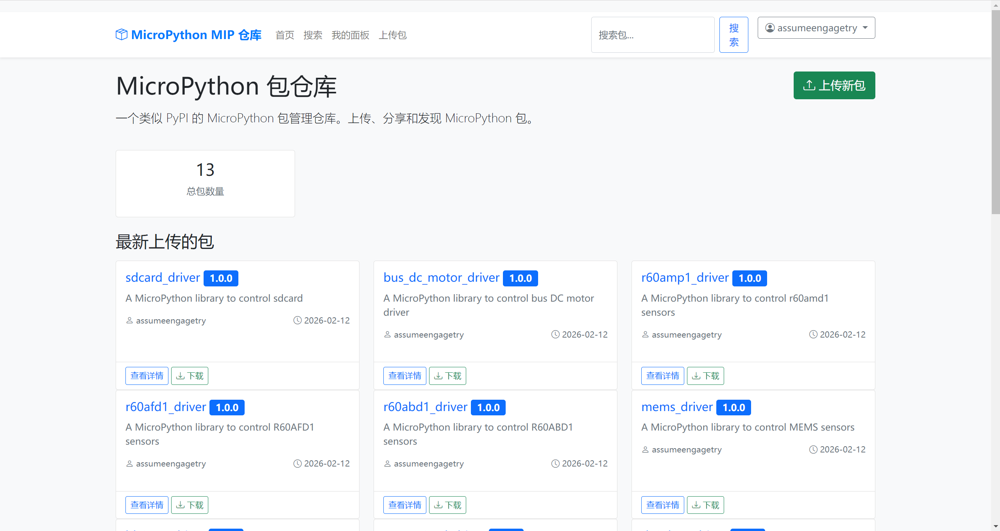


# 📂 目录结构与模块说明

仓库按硬件功能分类，结构清晰，以下是各文件夹及包含模块的详细介绍:

```plantuml
GraftSense-Drivers-MicroPython/
├── input/                  # 输入类模块（如按钮、摇杆、编码器等）
├── storage/                # 存储类模块（如SD卡、Flash等）
├── misc/                   # 杂项功能模块
├── lighting/               # 发光/显示类模块（如LED、NeoPixel等）
├── signal_generation/      # 信号发生类模块（如PWM、波形生成等）
├── motor_drivers/          # 电机驱动类模块（如直流电机、步进电机、舵机等）
├── signal_acquisition/     # 信号采集类模块（如ADC、传感器数据采集等）
├── sensors/                # 传感器类模块（如温湿度、气压、红外、超声波等）
├── communication/          # 通信类模块（如UART、I2C、SPI、蓝牙等）
├── docs/                   # 详细文档、应用说明和项目截图
├── code_checker.py         # 自定义代码规范检查脚本，用于检查 MicroPython 驱动文件的全局变量、参数校验等规则
├── easy_driver_module_scanner.py # 驱动模块扫描工具，递归扫描所有code文件夹，筛选单文件单类驱动模块
├── list_package_info.py    # 可视化扫描工具，查看所有package.json配置
├── modify_package_json.py  # 批量修改工具，标准化urls路径和字段
├── rename_readme.py        # 批量重命名工具，统一README.md文件名
└── .pre-commit-config.yaml # pre-commit 钩子配置文件
```

# 📦 包管理与安装（支持 mip /mpremote/upypi）

所有模块均通过 package.json 标准化配置，支持多种安装方式，满足不同开发场景需求。

## 方式一:代码内通过 mip 安装（开发板联网）

适用于开发板已连接网络（如 WiFi）的场景，直接在代码中执行安装:

1. 确保开发板已烧录 MicroPython 固件（推荐 v1.23.0 及以上版本）。
2. 在代码中通过 `mip` 安装指定模块，示例:
3. python
4. 运行

```python
import mip

# 安装RCWL9623超声波模块驱动
mip.install("github:FreakStudioCN/GraftSense-Drivers-MicroPython/sensors/rcwl9623_driver")

# 安装PS2摇杆驱动
mip.install("github:FreakStudioCN/GraftSense-Drivers-MicroPython/input/ps2_joystick_driver")
```

1. 安装后直接导入使用，示例（以 TCR5000 循迹模块为例）:
2. python
3. 运行

```python
from tcr5000 import TCR5000
from machine import Pin

# 初始化模块（连接GP2引脚）
# 读取检测状态（0=检测到黑线，1=检测到白线）print("检测状态:", sensor.read())
sensor = TCR5000(Pin(2, Pin.IN))
```

## 方式二:通过 mpremote 命令行安装（开发板串口连接）

适用于开发板未联网、仅通过串口连接电脑的场景，需先安装 mpremote 工具:

步骤 1:安装 mpremote（电脑端）
```bash
# 使用pip安装mpremote
pip install mpremote
```

步骤 2:通过串口执行 mip 安装
```bash
# 简化写法（自动识别串口）
mpremote mip install github:FreakStudioCN/GraftSense-Drivers-MicroPython/input/ps2_joystick_driver
```

## 方式三:通过 upypi 包源安装（推荐）
我们提供专属 upypi 包源，访问速度更快、安装更稳定，你可以访问[**upypi网站**](https://upypi.net/)，搜索要安装的对应包的名称，打开直接复制指令在 终端运行即可:
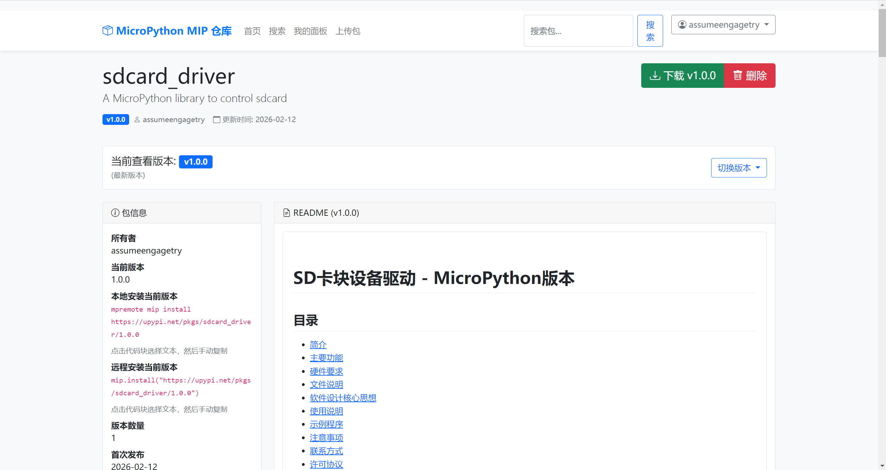

# 🔧 开发环境准备

1. **固件烧录**:从 [MicroPython 官网](https://micropython.org/) 下载对应开发板固件（如树莓派 Pico 选择 `rp2-pico` 系列），按住 `BOOTSEL` 键连接电脑，将 `.uf2` 固件拖入识别的 U 盘完成烧录。
2. **开发工具**:推荐使用 Thonny（[thonny.org](https://thonny.org/)），支持语法高亮、串口调试和文件传输，连接后在右下角选择设备为 `MicroPython (Raspberry Pi Pico)` 即可开发。

# 辅助工具使用

仓库内置 3 个实用工具，提升开发效率:
```bash
# 1. 可视化扫描所有package.json（查看字段完整性、双击打开文件）
python list_package_info.py

# 2. 批量标准化package.json配置（自动修复urls路径、补充字段）
python modify_package_json.py

# 3. 统一文档命名（递归将所有.md文件重命名为README.md）
python rename_readme.py

# 4. 驱动模块扫描（递归扫描code文件夹，筛选单文件单类驱动）
python easy_driver_module_scanner.py
```

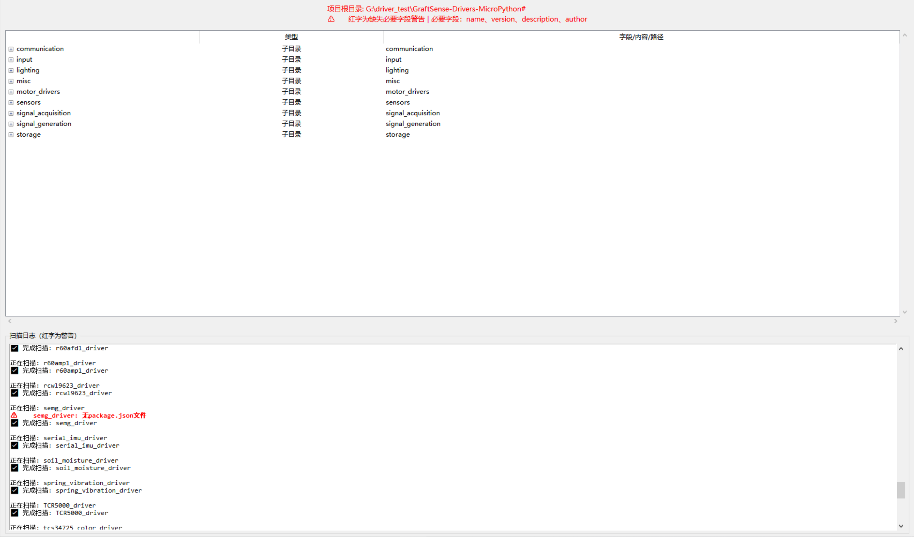
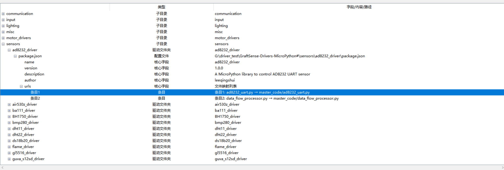
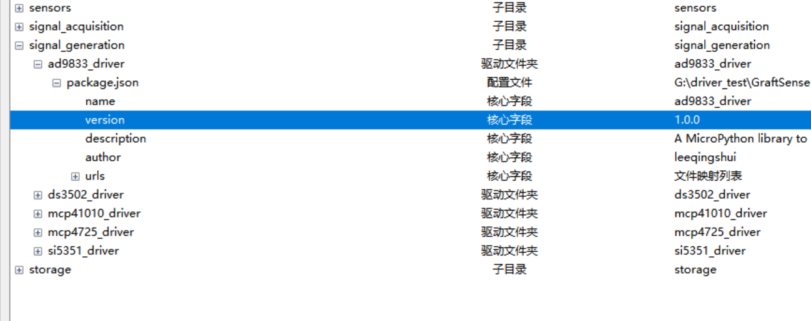
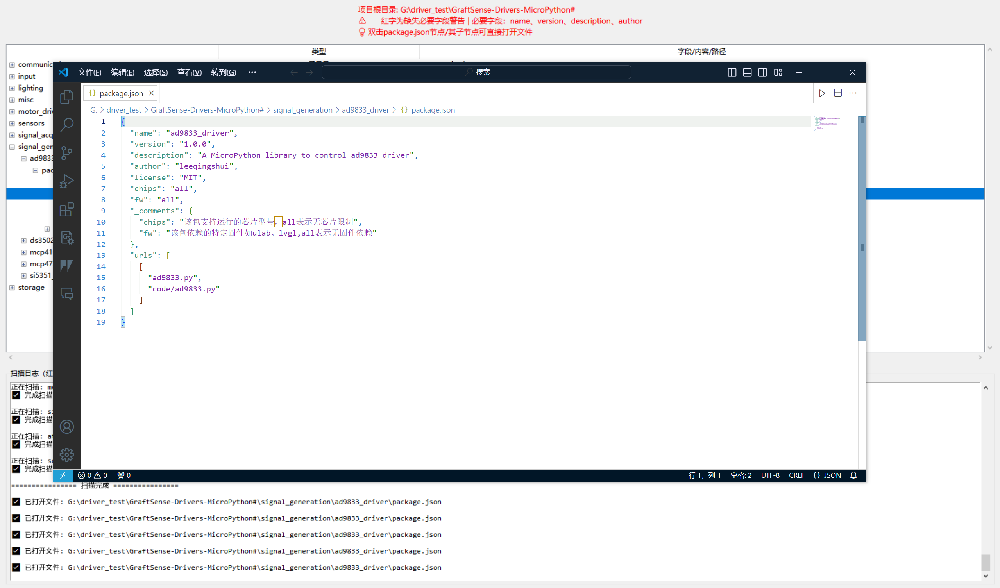
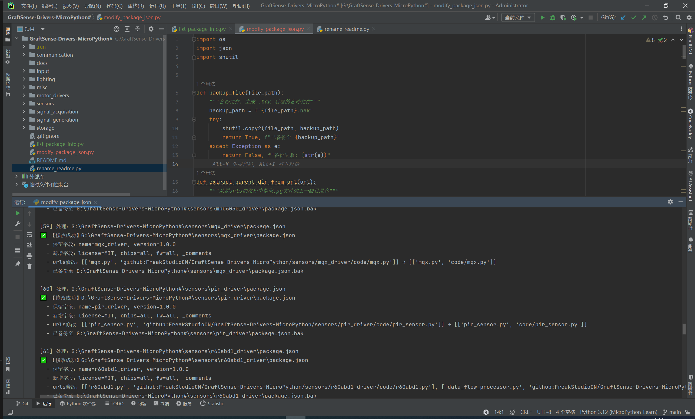
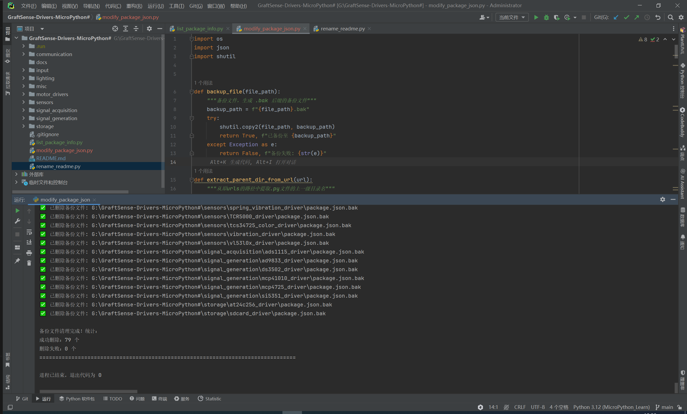

# 🧹 代码规范与提交检查

`.pre-commit-config.yaml` 是仓库的 `pre-commit` 钩子配置文件，用于定义代码提交前需要执行的检查规则，核心作用:
* 指定要使用的代码检查工具（如 `black`、`flake8`）及对应版本；
* 配置工具的运行参数（如 `black` 的行长度、`flake8` 忽略的错误码）；
* 实现「提交代码前自动执行规范检查」，避免不合规代码推送到远程仓库。

开发过程中需遵循代码规范，确保提交的代码符合质量要求，以下是核心操作说明。

## 依赖安装
开发工程师需先在电脑端通过 `pip` 安装代码规范检查工具:
```bash
# 安装black（代码格式化工具）和flake8（代码语法/规范检查工具）
pip install black flake8 pre-commit
```

接着在仓库根目录，执行以下命令初始化 `pre-commit` 钩子:
```bash
# 这个命令会在 .git/hooks/ 目录下生成 pre-commit 脚本，之后每次提交都会自动触发检查。
pre-commit install
```

初始化完成后，后续提交代码时，pre-commit 钩子会自动执行:
1. 代码格式化（`black`）
2. 代码语法 / 规范检查（`flake8`）
3. 自定义代码规范检查（`code_checker.py`）
4. 若检查不通过，会阻止提交，提示修复问题。

## 自定义代码检查脚本（code_checker.py）
`code_checker.py` 是仓库新增的专项代码规范检查脚本，用于补充 `pre-commit` 钩子的检查规则，针对 `MicroPython` 驱动文件（如传感器、通信模块等）进行更细致的规范校验，核心检查规则包括：
* 非 `main.py` 文件：必须包含 4 个顶层全局变量（`__version__`、`__author__`、`__license__`、`__platform__`）
* 非 `main.py` 文件：必须包含独立的 # @License : MIT 注释行
* 所有文件：`raise`/`print` 语句中不允许出现中文字符
* `main.py` 文件：全局变量区禁止实例化，实例化必须放在初始化配置区；`while` 循环仅允许出现在主程序区
* 所有文件：`__init__` 方法必须包含参数类型注解
* 非 `main.py` 文件：类中所有有入口参数的方法必须包含参数合法性校验（`isinstance`/`hasattr`/ 取值判断 + `raise`）

该脚本已集成到 `pre-commit` 钩子中，提交代码时会自动执行；也可通过命令行手动运行，对指定文件或目录进行检查：
```bash
# 检查单个文件
python code_checker.py ./sensors/BH1750_driver/code/bh_1750.py

# 检查同级所有文件夹（递归，包括子文件夹的子文件夹）
python code_checker.py . -r
```
检查同级所有文件夹（递归，包括子文件夹的子文件夹）输出如下：
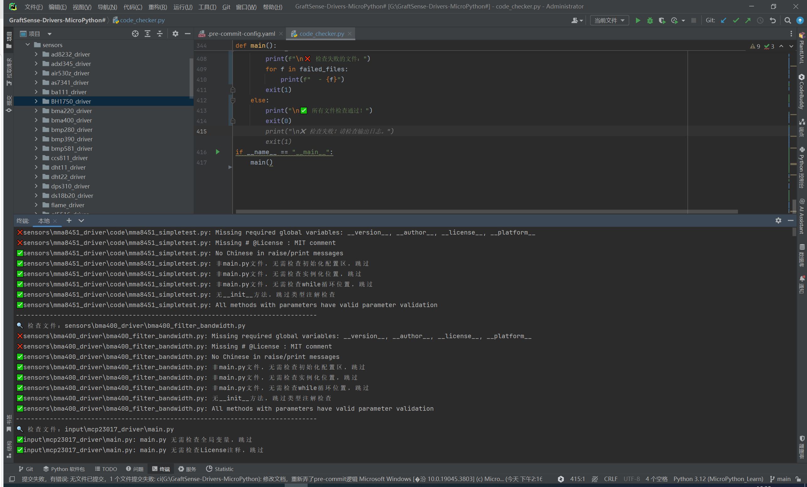
检查单个文件输出如下：
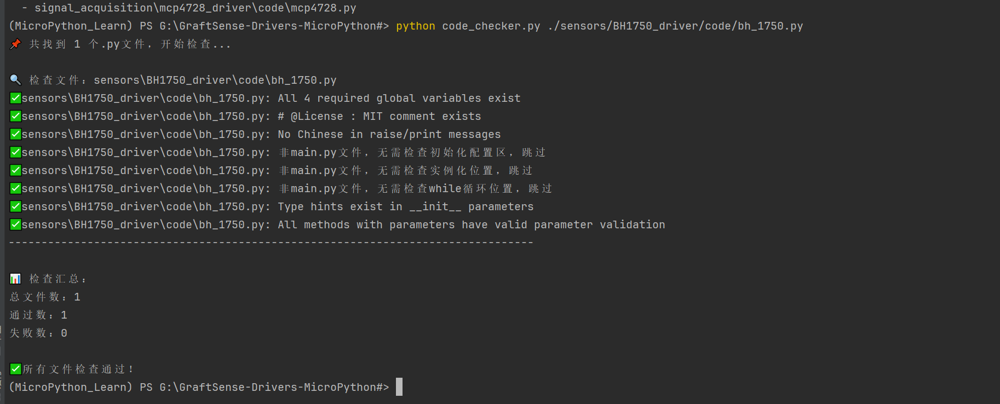

## 推送前手动检查
我们也可以使用下面命令手动执行全量检查，提前发现规范问题:
```bash
# 执行所有pre-commit钩子检查（包含black格式化、flake8语法检查）
pre-commit run --all-files
```

## 提交实例：自定义代码检查器（code_checker.py）检查失败（真实合规问题）

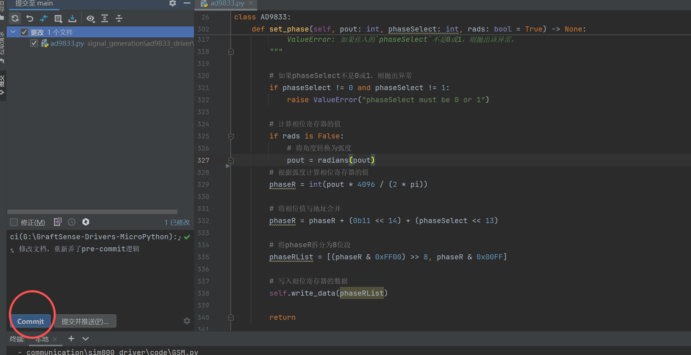

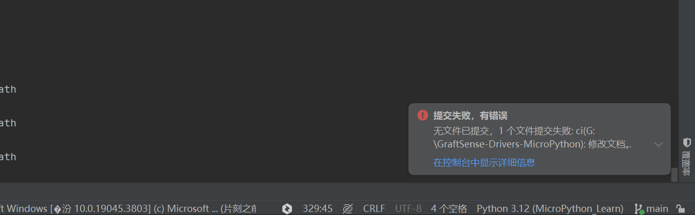

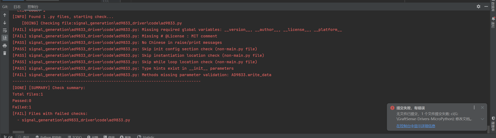

提交 `signal_generation/ad9833_driver/code/ad9833.py` 时，`black` 和 `flake8` 钩子均通过，但 `code_checker.py` 检查失败，终端输出如下：
```
[main 6612fc9] ci(G:\GraftSense-Drivers-MicroPython): 修改文档，重新弄了pre-commit逻辑
 3 files changed, 34 insertions(+), 19 deletions(-)
 create mode 100644 docs/check_all.png
 create mode 100644 docs/check_single.png
17:33:32.265: [GraftSense-Drivers-MicroPython#] git -c credential.helper= -c core.quotepath=false -c log.showSignature=false add --ignore-errors -A -f -- signal_generation/ad9833_driver/code/ad9833.py
17:33:32.396: [GraftSense-Drivers-MicroPython#] git -c credential.helper= -c core.quotepath=false -c log.showSignature=false commit -F C:\Users\Administrator\AppData\Local\Temp\git-commit-msg-.txt --
[main 80a75be] ci(G:\GraftSense-Drivers-MicroPython): 修改文档，重新弄了pre-commit逻辑
 1 file changed, 1 deletion(-)
17:33:51.353: [GraftSense-Drivers-MicroPython#] git -c credential.helper= -c core.quotepath=false -c log.showSignature=false add --ignore-errors -A -f -- signal_generation/ad9833_driver/code/ad9833.py
17:33:51.553: [GraftSense-Drivers-MicroPython#] git -c credential.helper= -c core.quotepath=false -c log.showSignature=false commit -F C:\Users\Administrator\AppData\Local\Temp\git-commit-msg-.txt --
Microsoft Windows [�汾 10.0.19045.3803]
(c) Microsoft Corporation����������Ȩ����
(MicroPython_Learn) G:\GraftSense-Drivers-MicroPython#>black....................................................................Passed
flake8...................................................................Passed
Run Code Checker.........................................................Failed
- hook id: run-code-checker
- exit code: 1
[INFO] Found 1 .py files, starting check...
	[DOING] Checking file:signal_generation\ad9833_driver\code\ad9833.py
[FAIL] signal_generation\ad9833_driver\code\ad9833.py: Missing required global variables: __version__, __author__, __license__, __platform__
[FAIL] signal_generation\ad9833_driver\code\ad9833.py: Missing # @License : MIT comment
[PASS] signal_generation\ad9833_driver\code\ad9833.py: No Chinese in raise/print messages
[PASS] signal_generation\ad9833_driver\code\ad9833.py: Skip init config section check (non-main.py file)
[PASS] signal_generation\ad9833_driver\code\ad9833.py: Skip instantiation location check (non-main.py file)
[PASS] signal_generation\ad9833_driver\code\ad9833.py: Skip while loop location check (non-main.py file)
[PASS] signal_generation\ad9833_driver\code\ad9833.py: Type hints exist in __init__ parameters
[FAIL] signal_generation\ad9833_driver\code\ad9833.py: Methods missing parameter validation: AD9833.write_data
--------------------------------------------------------------------------------
[DONE] [SUMMARY] Check summary:
Total files:1
Passed:0
Failed:1
[FAIL] Files with failed checks:
  - signal_generation\ad9833_driver\code\ad9833.py
```

这是因为 `ad9833.py` 作为非 `main.py` 的驱动文件，未满足 `code_checker.py` 定义的核心规范：
* 缺失顶层全局变量：未定义 `__version__`、`__author__`、`__license__`、`__platform__` 四个必填全局变量；
* 缺失 `License` 注释：未包含独立的 `# @License : MIT` 注释行；
* 方法参数校验缺失：`AD9833.write_data` 方法有入口参数，但未添加合法性校验（如 `isinstance`/ 取值判断 + `raise`）。

修改完成后，重新执行提交命令，`code_checker.py` 检查将全部通过，提交成功。

## 特殊情况说明

### 情况 1：MicroPython 与标准 Python 语法差异导致的 flake8 误报
部分检查报错是由于 `MicroPython`（`mpy`）与标准 `Python`（`py`）语法 / 内置对象差异导致的误报，并非代码实际功能问题（如 `const` 函数未定义），可通过在文件开头导入 `from micropython import const` 或在 `flake8` 配置中忽略对应错误码解决。

### 情况 2：black 自动格式化导致的钩子 “失败”（正常机制）
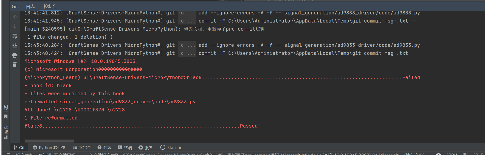
从控制台输出可见，`black` 钩子标注为「Failed」，但这并非代码错误，而是 `pre-commit` 的标准保护机制：

* 现象：`black` 输出提示 1 file reformatted，同时返回非零退出码，阻止代码提交；`flake8` 等其他钩子可能正常通过。
* 原因：`black` 检测到代码不符合格式化规范，已自动完成代码格式化；为了提醒开发者文件已被修改，它会主动阻止提交，需开发者确认格式化后的内容。
* 解决方法（需在 `Git Bash` 中执行）： 这是 `pre-commit` 的核心设计逻辑（先格式化→提醒修改→重新提交），只需两步即可完成合规提交：

```bash
# 步骤1：将 black 格式化后的文件重新加入暂存区（以 ad9833.py 为例）
git add signal_generation/ad9833_driver/code/ad9833.py

# 步骤2：再次执行提交命令，此时 pre-commit 所有钩子会全部通过
git commit -m "你的提交信息"
```

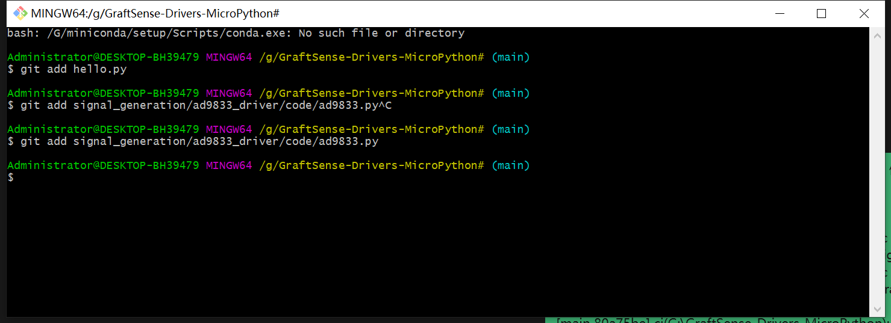

## 临时跳过钩子推送（谨慎使用）
若需临时跳过检查推送代码，可执行以下命令临时禁用 `Git` 钩子:
```bash
# 临时禁用本地Git钩子（Windows系统）
git config --local core.hooksPath NUL
```
⚠️ 重要提醒:推送完成后，务必执行以下命令恢复钩子配置，避免后续提交永久跳过检查:
```bash
# 恢复本地Git钩子配置
git config --local --unset core.hooksPath
```

# 📜 许可协议

本仓库所有驱动程序（除 `MicroPython` 官方模块和参考的相关模块外）均采用`MIT`许可协议。

# 📞 联系方式

如有问题或建议，欢迎提交 Issue 或 Pull Request 参与贡献！

- 邮箱:10696531183@qq.com
- GitHub 仓库:[https://github.com/FreakStudioCN/GraftSense-Drivers-MicroPython](https://github.com/FreakStudioCN/GraftSense-Drivers-MicroPython)

